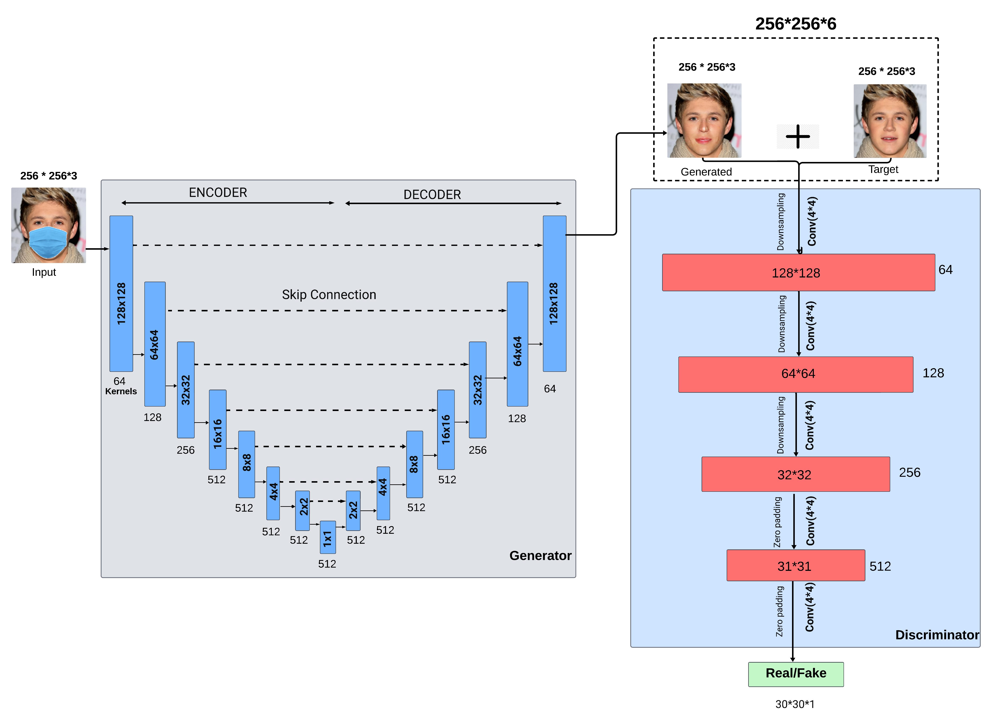

# Mask2Face

Can you virtually remove a face mask to see what a person looks like underneath? Our Machine Learning team proves it’s possible via an image inpainting-based ML solution.

  
**Figure: Model Architecture (U-Net based GAN with skip connections)**

---

## 🚀 Project Overview

The pervasive adoption of face masks during the COVID-19 pandemic has introduced significant challenges to facial recognition systems, particularly in security and authentication. This project addresses the issue of incomplete facial data caused by mask occlusion by employing **Generative Adversarial Networks (GANs)** to perform high-resolution face inpainting.

Our approach involves:
- **U-Net Architecture** with skip connections to retain spatial details.
- A **Total Generator Loss Function** combining Mean Absolute Error (MAE) and regularization to prevent overfitting.
- Training on the **CelebA-HQ dataset**, generating synthetic masked faces for evaluation.

**Key Metrics**:
- **PSNR**: 22.25  
- **SSIM**: 0.874  
- Performance surpasses traditional GANs, non-learning-based methods, and certain diffusion-based techniques.

---

## 🖼️ Results

  
**Figure: Examples of Results** (input | expected output | actual output)

---

## 🎥 Watch the Project Walkthrough

Click the image below to watch the project walkthrough on YouTube:  
[](https://www.youtube.com/watch?v=0LLw30HHPl0&ab_channel=satyamdubey)

---

## 🔧 How to Run This Project

### 🖥️ Environment Setup

1. Clone the repository and navigate to the project directory.
2. Ensure you have [Conda](https://docs.conda.io/en/latest/) installed.
3. If your **system does not have an Nvidia CUDA device**, comment out `tensorflow-gpu==2.2.0` in the `environment.yml` file.
4. For MacOS users, replace `tensorflow==2.2.0` with `tensorflow==2.0.0` in the `environment.yml` file.
5. Create and activate the environment:
   ```bash
   conda env create -f environment.yml
   conda activate mask2face
